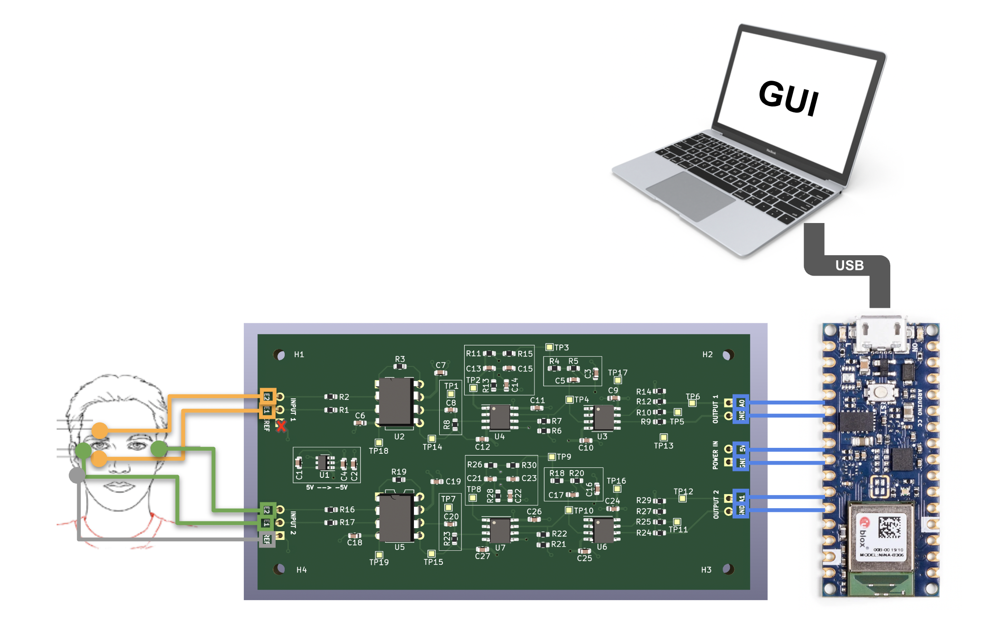

# eog-eye-tracking
Exploration of EOG (electrooculogram) signals as a potential human computer interface.

## Project Description
This project was one of [Neurotech@Berkeley](https://github.com/neurotech-berkeley)'s Devices Division projects in Spring 2022. At Devices, we build hardware for the brain - to measure and analyze electrical signals generated by our bodies to see if we can come up with new ways to interact with computers. You can learn more about our organization as a whole at [neurotech.berkeley.edu](https://neurotech.berkeley.edu/).

Inspired by the potential that the gaze-tracking systems, we set out to explore a technique with substantially lower computational cost than computer vision: electrooculography (EOG). Unlike computer vision that relies on cameras, EOG relies on intrintic electric signals generated in our eye.

In this project, we prototyped, designed, fabricated, and tested analog front end (AFE) circuit to control a dinosaur chrome game. 

## Demo

In this demo, we connected our custom-designed PCB to a laptop through an Arduino. The dinosaur is controlled by blinks alone, hands and keyboard-free.

## Function Diagram
